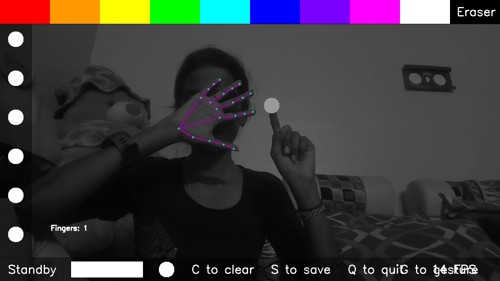

# AI Virtual Paint Application 🎨

This project is an AI-based virtual paint application that leverages the power of MediaPipe and OpenCV to create a fun and interactive drawing experience. The application allows users to draw on the screen using hand gestures detected by a webcam.

## Features

- **Gesture-Based Drawing:** Drawing is controlled by hand gestures. If the left hand is open, drawing is disabled; if it is closed, drawing is enabled.
- **Right-Hand Drawing:** The right hand is used for drawing on the screen.
- **Color Palette:** Select different colors to draw with.
- **Brush Size:** Adjust the brush size for drawing.
- **Eraser:** Erase parts of your drawing with an eraser tool.
- **Clear Canvas:** Clear the entire drawing canvas.
- **Save Drawing:** Save your drawing locally as an image file.
- **Quit Application:** Easily exit the application.
- **Finger Count Display:** The number of fingers on the right hand is displayed on the screen.

## Technologies Used

- **[MediaPipe](https://google.github.io/mediapipe/solutions/hands):** A framework for building multimodal (video, audio, etc.) machine learning pipelines.
- **[OpenCV](https://opencv.org):** A library of programming functions mainly aimed at real-time computer vision.

## How It Works

1. **Hand Detection:** The application uses MediaPipe to detect the left and right hands in the webcam feed.
2. **Gesture Recognition:** The left-hand gesture controls whether drawing is enabled or disabled. The right hand is used to draw on the screen based on the detected finger position.
3. **Drawing:** Users can draw on the virtual canvas by moving their right hand in front of the camera. The drawing will follow the right hand's index finger.
4. **UI Elements:** A set of UI elements allows users to change colors, brush sizes

## Installation

1. Clone the repository:
   ```bash
   git clone https://github.com/bhuvani1102/AI_Virtual_Paint.git
   ```
2.Navigate to the project directory:
  ```bash
  cd AIVirtualPainter
 ```
3.Run the application:
```bash
python paint.py
```
## Sample Output



## Contact

For any questions or feedback, please reach out to me via [bhuvani1102@gmail.com](mailto:bhuvani1102@gmail.com).


